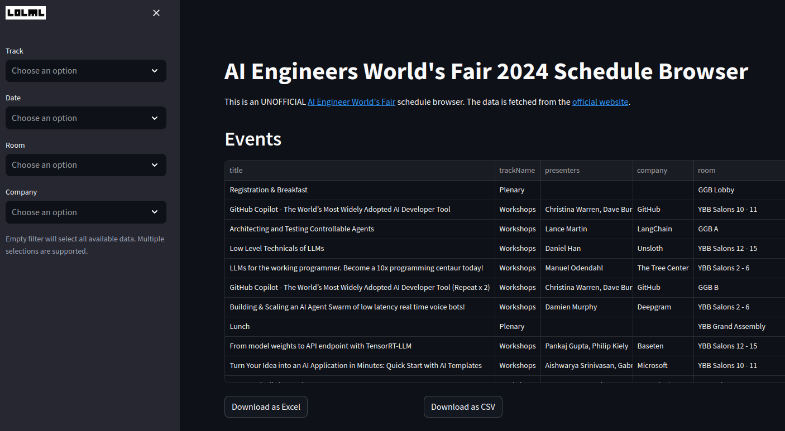

# An unofficial AI Engineer World's Fair (2024) Schedule Browser

This tool downloads and processes the schedule data of the [AI Engineer World's Fair 2024](https://www.ai.engineer/worldsfair), that 
can be found [here](https://www.ai.engineer/worldsfair/2024/schedule).

### Features

* Browse the schedule.
* Export schedule data to Excel or as a CSV file.
* Filter by date, time, track, etc.
* Enjoy some neat data visualizations. (coming soon)

### Screenshot



# Installation

This is a simple streamlit app. The following installation instructions use the Conda package 
manager. The instructions also work verbatim with `Mamba` and `micromamba`.

## Local Installation

Clone the repo: 

```
git clone [repo_url]
```

### Environment setup for Anaconda

While in the repository directory, run the following command in a terminal:

```
conda create -n aiewf --yes --file conda_packages.txt -c conda-forge
conda activate aiewf
```

### Run the app:

- Navigate to the repository directory in your terminal.
- Activate the `aiewf` environment (`conda activate aiewf`).
- Run the app with streamlit: `streamlit run app.py`.
- Access app in your browser at `http://localhost:8501`.


The app should now be running on `http://localhost:8501` in your browser.

# Copyright and License

Copyright (c) 2024 [LOLML GmbH](https://lolml.com/), Julian Wergieluk, George Whelan

MIT License: see LICENSE file for details.

# Legal Notice

THE SOFTWARE IS PROVIDED "AS IS", WITHOUT WARRANTY OF ANY KIND, EXPRESS OR
IMPLIED, INCLUDING BUT NOT LIMITED TO THE WARRANTIES OF MERCHANTABILITY,
FITNESS FOR A PARTICULAR PURPOSE AND NONINFRINGEMENT. IN NO EVENT SHALL THE
AUTHORS OR COPYRIGHT HOLDERS BE LIABLE FOR ANY CLAIM, DAMAGES OR OTHER
LIABILITY, WHETHER IN AN ACTION OF CONTRACT, TORT OR OTHERWISE, ARISING FROM,
OUT OF OR IN CONNECTION WITH THE SOFTWARE OR THE USE OR OTHER DEALINGS IN THE
SOFTWARE.
